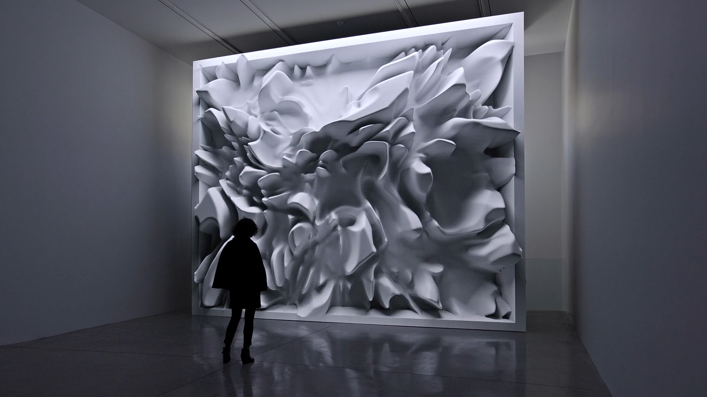
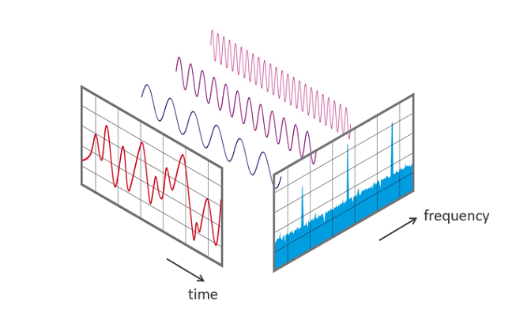
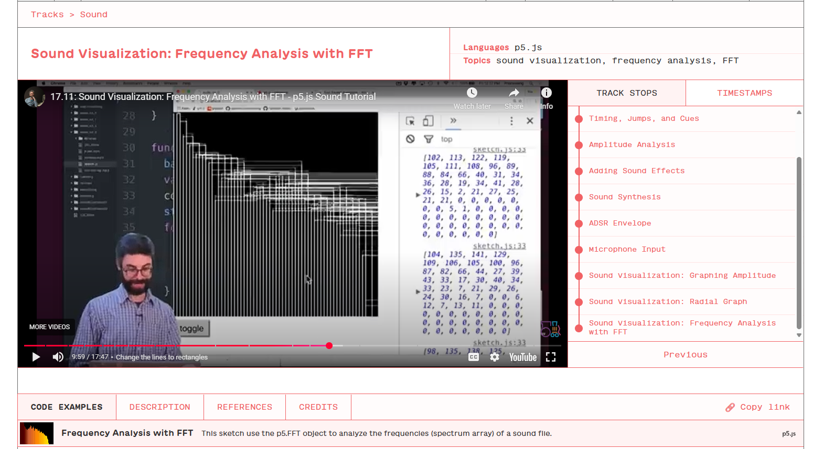

# Week-8-Quiz
HELLO WORLD
<br>
<br>

### Part 1: Imaging Technique Inspiration

[Melting Memories - Refik Anadol (2018)](https://refikanadol.com/works/melting-memories/)



I’m inspired by Refik Anadol’s Melting Memories (2018), which visualizes emotional data as liquid, reflective forms. Instead of simplifying its complex data-driven approach, I want to reinterpret its concept through sound frequencies.

By translating low, mid, and high frequencies into distinct resonant visual energies, sound becomes an alternative form of emotional data. The rippling motion and reflective textures will embody how different frequency ranges interact like layers of consciousness—slow, heavy waves for low tones, shimmering details for highs, and balanced pulses in between—creating a visual language of resonance that echoes Anadol’s exploration of emotion through movement and light.


<br>
<br>

### Part 2: Coding Technique Exploration

[Making Audio Reactive Visuals with FFT – Sangarshanan (2024)](https://sangarshanan.com/2024/11/05/visualising-music/)



To translate energy into visual resonance, I need a method that can decompose sound into distinct layers of motion and texture. **FFT (Fast Fourier Transform)** perfectly aligns with this idea—it breaks sound down into frequency bands, revealing the hidden structure and intensity of low, mid, and high tones. These frequencies can then act as emotional drivers within the visual space.  

Inspired by Sangarshanan’s tutorial on audio-reactive visuals, I plan to use p5.js’s FFT analysis to map these frequency ranges onto wave behaviors: low frequencies forming slow, heavy ripples; mid frequencies generating rhythmic pulses; and high frequencies creating shimmering reflections.
<br>
<br>

[Sound Visualization Example - thecodingtrain](https://thecodingtrain.com/tracks/sound/sound/11-sound-visualization-frequency-analysis?utm_source=chatgpt.com)

```javascript
// Basic setup for FFT analysis in p5.js
let mic = new p5.AudioIn();
mic.start();
let fft = new p5.FFT();
fft.setInput(mic);
let spectrum = fft.analyze();
```


### Thank You :)

